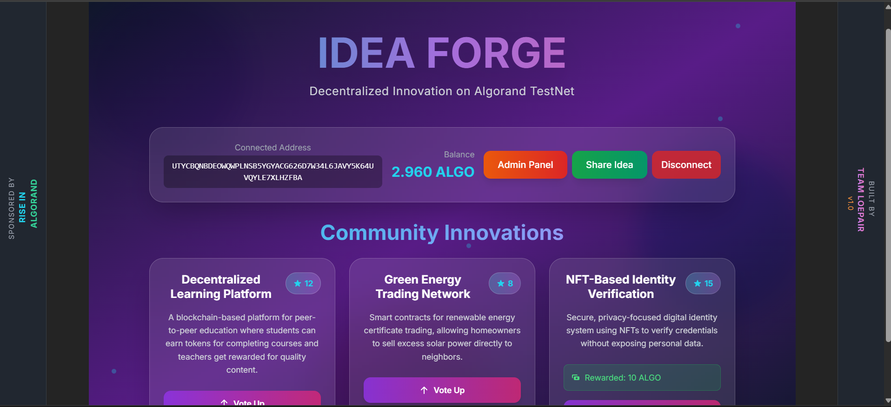

# 🚀 IdeaVotingApp – Algorand SDK 

<p align="center">
  
  
  
</p>

<p align="center">
  <b>On-chain startup idea sharing platform with voting, built with 💙 on Algorand.</b>  
</p>

---

## ✨ Overview  

**IdeaVotingApp** is a fully on-chain **startup idea sharing and voting platform** powered by **Algorand Smart Contracts**.  
Participants can submit ideas, vote on the best ones, and see winners — **all stored on-chain** for transparency and fairness.  

### 🎯 Features  
- 📝 **Submit Ideas** – Users can submit new startup ideas stored in global state  
- 👍 **Vote Once** – Each account can vote only once per idea (anti-spam protection)  
- 🏆 **Award Winners** – Contract tracks votes to easily pick top ideas  
- 🔐 **Trustless & Transparent** – Every vote and idea is verifiable on Algorand blockchain  
- ⚡ **Fast Localnet Deployments** – Powered by [AlgoKit](https://github.com/algorandfoundation/algokit)  

---

## 🏗️ Tech Stack  

| Component          | Tech Used                     |
|-------------------|-----------------------------|
| **Smart Contract** | [AlgoKit](https://github.com/algorandfoundation/algokit), TEALScript |
| **Language**       | TypeScript                  |
| **Deployment**     | LocalNet / TestNet / MainNet |
| **Frontend (Optional)** | React / Vite (Future Integration) |

---

## 📂 Project Structure  

```bash
algorand-contract/
├── smart_contracts/        # 📜 TEALScript contract logic
│   ├── IdeaVotingApp.ts    # Main contract code
│   └── index.ts            # Deployment & interaction scripts
├── .env                    # 🔑 Deployer mnemonic (ignored by Git)
├── package.json
├── tsconfig.json
└── README.md               # (You're here ❤️)
````

---

## 🚀 Getting Started

### 1️⃣ Install Prerequisites

* [Node.js](https://nodejs.org/) (LTS recommended)
* [AlgoKit CLI](https://github.com/algorandfoundation/algokit)

### 2️⃣ Setup & Install

```bash
git clone https://github.com/YOUR-USERNAME/IdeaVotingApp.git
cd IdeaVotingApp
npm install
```
📦 **Frontend :**  
Clone and run [algorand-frontend](https://github.com/ISHAAN-KKR/algorand-frontend) side by side with this repo:

```bash
git clone https://github.com/ISHAAN-KKR/algorand-frontend.git
cd algorand-frontend
npm install
npm run dev


### 3️⃣ Configure Environment

Create a `.env` file:

```env
DEPLOYER_MNEMONIC="your 25-word localnet mnemonic here"
```

### 4️⃣ Deploy to LocalNet

```bash
algokit project deploy localnet
```

✅ You should see output like:
`App deployed: IdeaVotingApp (1006)`

---

## 🔧 Interacting with the Contract

### 🆕 Add a New Idea

```bash
npm run call:addIdea "Decentralized Twitter"
```

### 👍 Vote for an Idea

```bash
npm run call:vote 0
```

*(where `0` is the idea index)*

---

## 📸 Screenshots / Demo

<p align="center">
  
</p>

---

## 🧠 Future Roadmap

* [ ] 🌐 React + Vite Frontend
* [ ] 📊 On-chain Leaderboard Dashboard
* [ ] 🏆 Automated Winner Selection & Rewards
* [ ] 🔗 Mainnet Deployment

---

## 🤝 Contributing

Contributions are welcome!

1. Fork this repo
2. Create a new branch: `feature/amazing-idea`
3. Submit a PR 🚀

---

## 📜 License

This project is licensed under the **MIT License** – see [LICENSE](LICENSE) for details.

---

<p align="center">
Made with ❤️ on <b>Algorand</b> · Built for builders, dreamers, and innovators 🧠🚀
</p>
